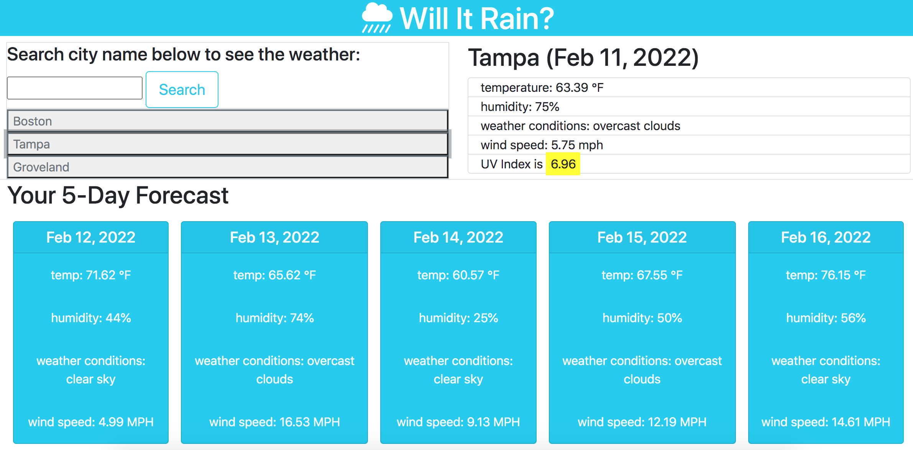

# will-it-rain

## Description

A simple and clean weather dashboard that can be used to quickly compare current weather and forecasts in multiple cities. 

## Table Of Contents

- [will-it-rain](#will-it-rain)
  - [Description](#description)
  - [Table Of Contents](#table-of-contents)
  - [Installation](#installation)
  - [Usage](#usage)
  - [Questions](#questions)

## Installation

No installation required! 

## Usage

Visit and use the deployed application here: https://pmanecci.github.io/will-it-rain-6/

Your previous searches will become buttons you can toggle between under the search box
  
## Questions

Any questions, please contact Patty Manecci

My email address is: pmanecci@gmail.com
My github profile is https://github.com/PManecci
